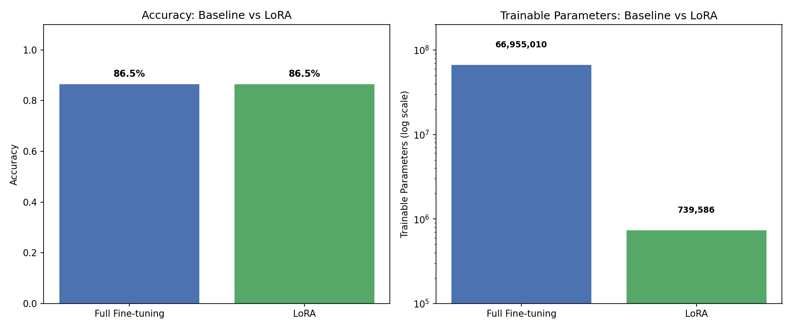

# LoRA vs Full Fine-Tuning: Sentiment Classification

Reproducing the core idea of **LoRA (Low-Rank Adaptation of Large Language Models)** — comparing traditional full fine-tuning against LoRA on a sentiment classification task, to measure the accuracy vs efficiency trade-off.

## Overview

This project fine-tunes `distilbert-base-uncased` on the SST2 sentiment dataset (positive/negative movie reviews) using two approaches:

1. **Full Fine-tuning (Baseline):** All 66.9M parameters updated
2. **LoRA:** Only 739K parameters (1.09%) updated, using low-rank adapter matrices injected into attention layers, while the base model stays frozen

## Results

| Method | Accuracy | Trainable Params | % of Model Trained | Train Time |
|---|---|---|---|---|
| Full Fine-tuning | 86.5% | 66,955,010 | 100% | 26.6s |
| **LoRA** | **86.5%** | **739,586** | **1.09%** | 31.9s |

**Key finding:** LoRA matched full fine-tuning accuracy while training ~99% fewer parameters.

## Method

- **Model:** DistilBERT (distilbert-base-uncased)
- **Dataset:** SST2 (GLUE benchmark), 1000 training samples, 200 validation samples
- **LoRA config:** rank (r)=8, alpha=16, dropout=0.1, applied to attention query/value layers
- **Training:** Hugging Face `Trainer`, learning rate 1e-3 (LoRA), 5e-5 (baseline)

## Key Learnings

- LoRA requires a higher learning rate than full fine-tuning since far fewer parameters are being updated per step
- Overfitting appeared after epoch 3 for LoRA (validation loss increased while training loss dropped) — best checkpoint was epoch 3
- Classification head parameters are trained fully by default even under LoRA, since they are randomly initialized and task-specific

## Tech Stack

`transformers` · `peft` · `datasets` · `evaluate` · PyTorch · Google Colab (T4 GPU)

## Files

- `lora-sentiment-project.ipynb` — full training and evaluation code
- `comparison_results.csv` — results table
- `comparison_chart.png` — accuracy and parameter comparison visualization
- `lora_results.json` — raw LoRA metrics

## Reference

Hu, E. J., et al. (2021). *LoRA: Low-Rank Adaptation of Large Language Models.* [arXiv:2106.09685](https://arxiv.org/abs/2106.09685)

## Author

Ananya — B.Tech CSE, Motihari College of Engineering

